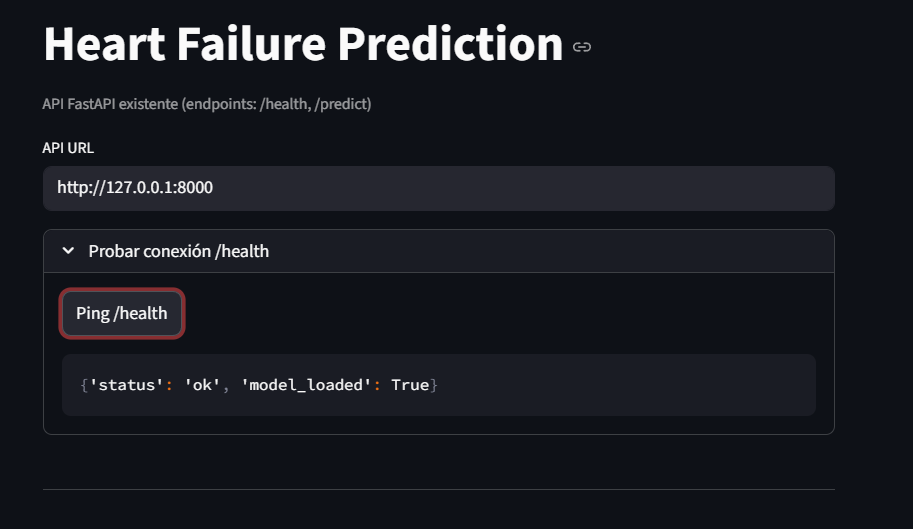
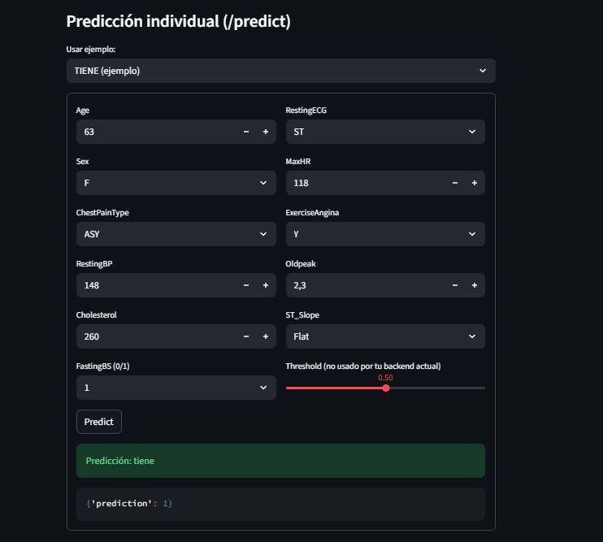

# Heart Failure Prediction — API + UI

Este README cubre el **backend mínimo** (FastAPI) y una **UI simple** (Streamlit) para predecir `HeartDisease` usando el dataset de **Heart Failure Prediction** (Kaggle). Está pensado para correr **localmente** sin complicaciones.

> **Notas rápidas**
> - El endpoint implementado es **`POST /predict`** (predice `0`/`1`).
> - La UI simple consume `/health` y `/predict`.
---

## 1) Estructura del proyecto

```
main.py            # API FastAPI 
train_heart.py     # Script de entrenamiento (genera heart_model.pkl)
ui_min.py          # UI mínima con Streamlit
heart_model.pkl    # Modelo entrenad
```

## 2) Requisitos

- Python 3.10+ (recomendado)


---

## 3) Dataset

Se usa la libreria de kaggle para usar **`heart.csv`**. Contiene las siguientes columnas exactamente:

```
Age, Sex, ChestPainType, RestingBP, Cholesterol, FastingBS,
RestingECG, MaxHR, ExerciseAngina, Oldpeak, ST_Slope, HeartDisease
```

> Para entrenar, se usa `HeartDisease` como **target** y el resto como features.

## 4) Levantamiento de la API

Instala FastAPI + Uvicorn en el mismo venv y arranca:

```bash
pip install -r requirements.txt

uvicorn main:app --reload --port 8000
```

Prueba el **health**:

```bash
curl -s http://127.0.0.1:8000/health
```

Respuesta esperada:
```json
{"status":"ok","model_loaded":true}
```

---

## 5) UI (Streamlit)

Instala y corre la UI:

```bash
pip install streamlit==1.38.0 requests==2.32.3
streamlit run ui_min.py
```

En la UI:
- URL por defecto: `http://127.0.0.1:8501`
- Botón **Ping /health**
- Formulario con los **11 campos** que espera `/predict`
- **Presets**: un ejemplo que suele dar **no_tiene** y otro **tiene**
- Muestra el **JSON** de la respuesta y una etiqueta amigable (“tiene” / “no_tiene”)

### Capturas




---

## 7) Esquema de `/predict`

### Request (JSON)
```json
{
  "Age": 58,
  "Sex": "F",
  "ChestPainType": "NAP",
  "RestingBP": 124,
  "Cholesterol": 220,
  "FastingBS": 0,
  "RestingECG": "Normal",
  "MaxHR": 165,
  "ExerciseAngina": "N",
  "Oldpeak": 0.8,
  "ST_Slope": "Up"
}
```

**Validaciones** (backend):
- `Sex`: **M** | **F**
- `ChestPainType`: **TA** | **ATA** | **NAP** | **ASY**
- `RestingECG`: **Normal** | **ST** | **LVH**
- `ExerciseAngina`: **Y** | **N**
- `ST_Slope`: **Up** | **Flat** | **Down**
- Rango numéricos: `Age` (1–120), `RestingBP` (0–300), `Cholesterol` (0–1000), `FastingBS` (0–1), `MaxHR` (0–250), `Oldpeak` (-5–10)

### Response (JSON)
```json
{ "prediction": 0 }
```
> **0** → `no_tiene`, **1** → `tiene`

---

## 8) Ejemplos rápidos con `curl`

### A) **NO_TIENE** (esperado)
```bash
curl -s -X POST "http://127.0.0.1:8000/predict" -H "Content-Type: application/json" -d '{
  "Age": 42, "Sex": "F", "ChestPainType": "ATA",
  "RestingBP": 118, "Cholesterol": 190, "FastingBS": 0,
  "RestingECG": "Normal", "MaxHR": 172, "ExerciseAngina": "N",
  "Oldpeak": 0.0, "ST_Slope": "Up"
}'
```

### B) **TIENE** (esperado)
```bash
curl -s -X POST "http://127.0.0.1:8000/predict" -H "Content-Type: application/json" -d '{
  "Age": 63, "Sex": "F", "ChestPainType": "ASY",
  "RestingBP": 148, "Cholesterol": 260, "FastingBS": 1,
  "RestingECG": "ST", "MaxHR": 118, "ExerciseAngina": "Y",
  "Oldpeak": 2.3, "ST_Slope": "Flat"
}'
```

> Los resultados exactos dependen del entrenamiento local. Estos ejemplos suelen representar perfiles de **menor** vs **mayor** riesgo.

---